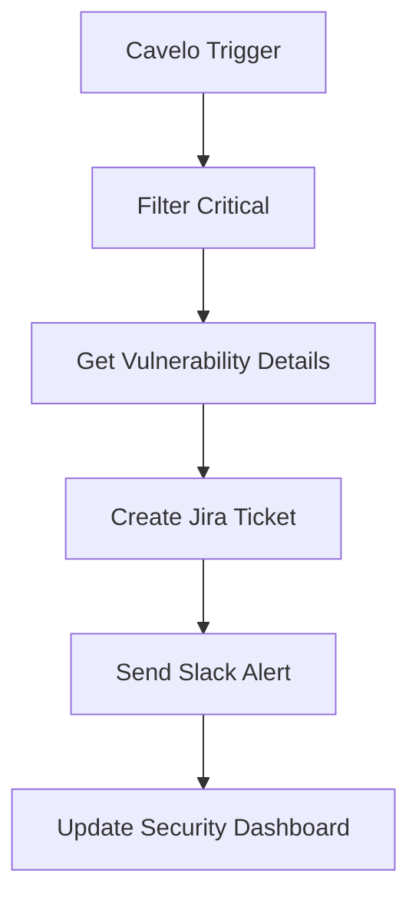
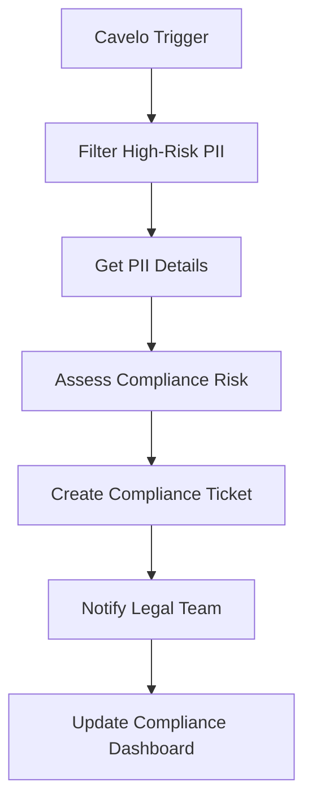
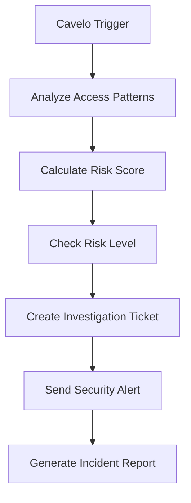
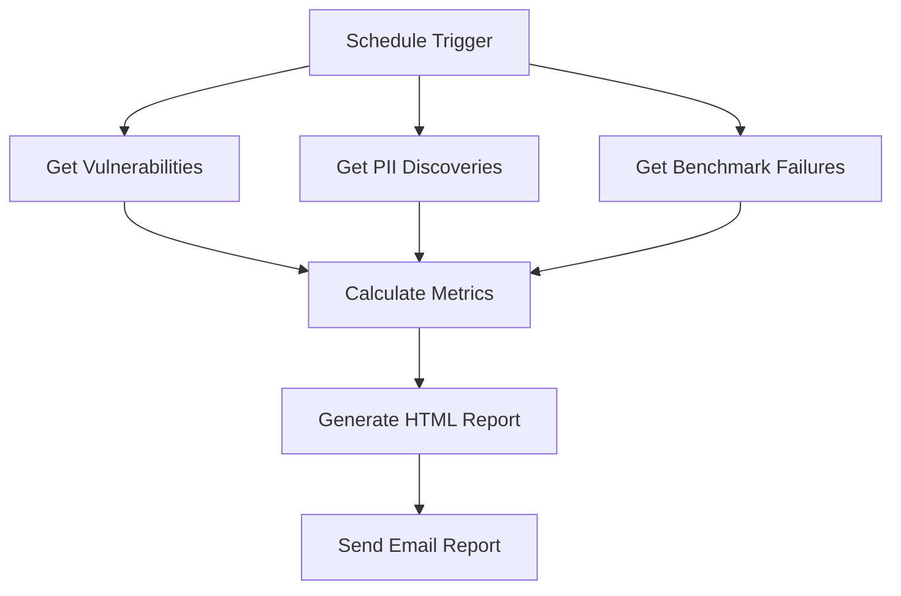
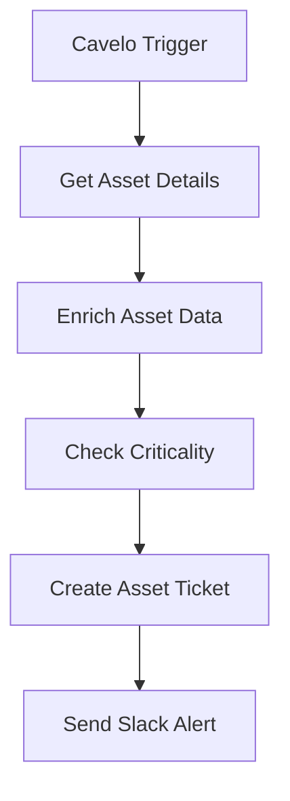
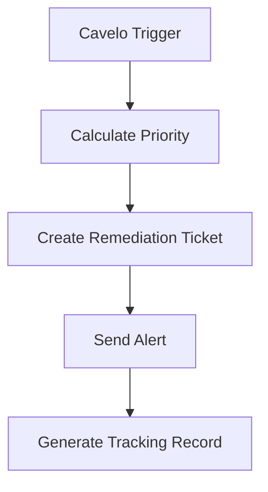
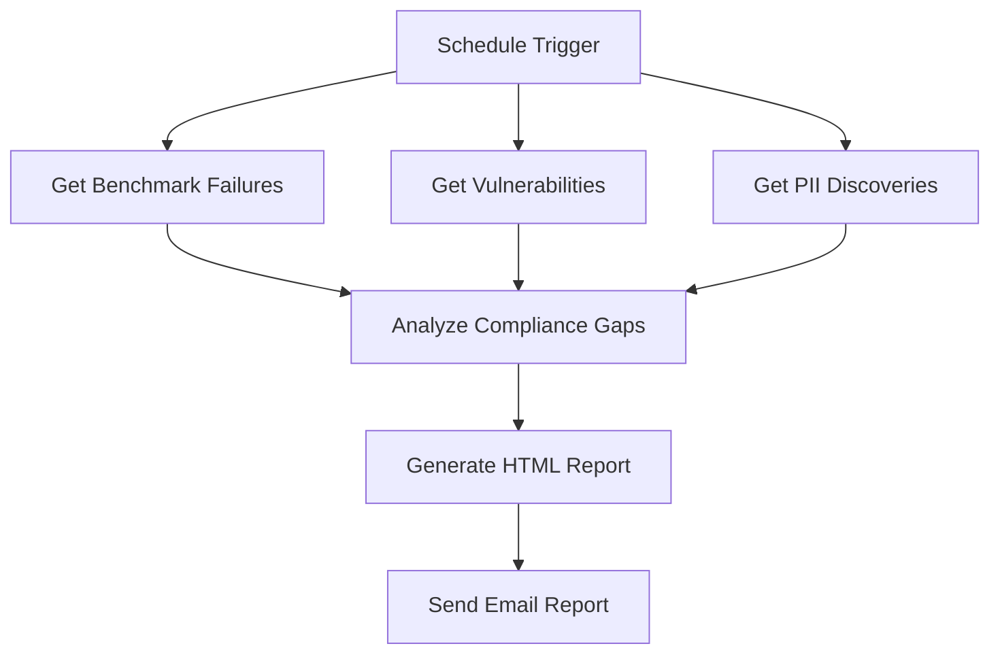

# Security Automation Workflows

<div align="center">


**Real-world security automation workflows for Cavelo n8n integration**

</div>

---

## 🚨 **Critical Vulnerability Alert Workflow**

### **Overview**
Automatically detects critical vulnerabilities (CVSS ≥ 9.0) and triggers immediate response actions including ticket creation, team notifications, and escalation procedures.

### **Workflow Structure**


### **Business Logic**
- **Risk Scoring**: CVSS v3 base score ≥ 9.0
- **Asset Context**: Production systems get higher priority
- **SLA Tracking**: 24-hour response time for critical vulnerabilities
- **Escalation**: Automatic escalation to CISO for critical production systems

### **Configuration**
```json
{
  "trigger": {
    "type": "newVulnerabilities",
    "severityThreshold": "critical",
    "pollingInterval": 15
  },
  "filters": {
    "cvssV3BaseScore": 9.0,
    "environments": ["production"]
  },
  "actions": [
    "createJiraTicket",
    "sendSlackAlert",
    "updateDashboard"
  ]
}
```

### **Output Example**
```json
{
  "vulnerabilityId": "CVE-2024-1234",
  "title": "Critical Remote Code Execution",
  "cvssScore": 9.8,
  "asset": {
    "hostname": "prod-web-01",
    "ipAddress": "192.168.1.100",
    "environment": "production"
  },
  "riskScore": 95,
  "priority": "CRITICAL",
  "slaDeadline": "2024-01-16T10:00:00Z",
  "assignedTo": "security-team",
  "jiraTicketId": "SEC-1234"
}
```

---

## 🔒 **PII Compliance Alert Workflow**

### **Overview**
Monitors for high-risk PII discoveries (SSN, Credit Card, Bank Account) and ensures compliance with regulatory requirements through automated notifications and reporting.

### **Workflow Structure**


### **Business Logic**
- **Data Classification**: SSN, Credit Card, Bank Account detection
- **Risk Assessment**: Confidence score and data sensitivity analysis
- **Compliance Mapping**: GDPR, SOX, HIPAA requirements
- **Legal Notification**: Automatic legal team alerts for sensitive data

### **Configuration**
```json
{
  "trigger": {
    "type": "newPii",
    "classifications": ["SSN", "Credit Card", "Bank Account"],
    "pollingInterval": 30
  },
  "filters": {
    "confidence": 80,
    "sourceTypes": ["agent", "cloud"]
  },
  "compliance": {
    "gdpr": true,
    "sox": true,
    "hipaa": false
  }
}
```

### **Output Example**
```json
{
  "piiId": "PII-2024-001",
  "classification": "SSN",
  "confidence": 95,
  "filePath": "/var/data/employee_records.csv",
  "asset": {
    "hostname": "hr-server-01",
    "department": "HR"
  },
  "complianceRisk": "HIGH",
  "regulations": ["GDPR", "SOX"],
  "legalNotification": true,
  "ticketId": "COMP-5678"
}
```

---

## 🔍 **Suspicious Access Investigation Workflow**

### **Overview**
Analyzes access patterns for suspicious activity, creates investigation tickets, and generates incident reports for potential security incidents.

### **Workflow Structure**


### **Business Logic**
- **Pattern Analysis**: Failed logins, unusual times, privilege escalation
- **Risk Scoring**: Multi-factor risk assessment algorithm
- **Investigation Workflow**: Automated ticket creation and assignment
- **Incident Reporting**: Comprehensive incident documentation

### **Configuration**
```json
{
  "trigger": {
    "type": "newAccessAudits",
    "pollingInterval": 15
  },
  "analysis": {
    "failedLoginThreshold": 3,
    "unusualTimeHours": [22, 23, 0, 1, 2, 3, 4, 5],
    "privilegeEscalation": true,
    "geographicAnomalies": true
  },
  "riskScoring": {
    "weights": {
      "failedLogins": 0.3,
      "unusualTimes": 0.2,
      "privilegeEscalation": 0.3,
      "geographicAnomalies": 0.2
    }
  }
}
```

### **Output Example**
```json
{
  "auditId": "AUDIT-2024-001",
  "userId": "user123",
  "userName": "john.doe",
  "riskScore": 85,
  "riskLevel": "HIGH",
  "suspiciousIndicators": [
    "Multiple failed login attempts",
    "Access outside business hours",
    "Privilege escalation detected"
  ],
  "investigationTicket": "SEC-9999",
  "incidentReport": "INC-2024-001"
}
```

---

## 📊 **Weekly Security Posture Report Workflow**

### **Overview**
Generates comprehensive weekly security reports with executive summaries, risk metrics, and compliance status for security leadership.

### **Workflow Structure**


### **Business Logic**
- **Data Aggregation**: Vulnerabilities, PII, benchmarks from last 7 days
- **Risk Calculation**: Overall security risk score
- **Compliance Tracking**: CIS benchmark compliance rates
- **Executive Summary**: High-level insights for leadership

### **Configuration**
```json
{
  "trigger": {
    "type": "schedule",
    "cronExpression": "0 9 * * 1"
  },
  "dataSources": {
    "vulnerabilities": {
      "severities": ["critical", "high"],
      "dateRange": "last7Days"
    },
    "pii": {
      "classifications": ["SSN", "Credit Card", "Bank Account"],
      "dateRange": "last7Days"
    },
    "benchmarks": {
      "statuses": ["fail"],
      "dateRange": "last7Days"
    }
  },
  "reporting": {
    "recipients": ["security-team@company.com", "executives@company.com"],
    "format": "html",
    "includeCharts": true
  }
}
```

### **Output Example**
```json
{
  "reportDate": "2024-01-15",
  "weekEnding": "2024-01-08",
  "riskScore": 75,
  "riskLevel": "MEDIUM",
  "metrics": {
    "criticalVulnerabilities": 3,
    "highVulnerabilities": 12,
    "piiDiscoveries": 8,
    "benchmarkFailures": 15,
    "complianceRate": 85
  },
  "recommendations": [
    "Address 3 critical vulnerabilities immediately",
    "Investigate 8 PII discoveries",
    "Improve CIS benchmark compliance from 85% to 95%+"
  ]
}
```

---

## 🖥️ **Asset Discovery Sync Workflow**

### **Overview**
Automates asset onboarding and security classification when new assets are discovered, including risk assessment and department assignment.

### **Workflow Structure**


### **Business Logic**
- **Asset Classification**: Server type, environment, department
- **Risk Assessment**: Criticality scoring based on multiple factors
- **Onboarding Automation**: Automatic ticket creation and assignment
- **Security Context**: Vulnerability and PII exposure analysis

### **Configuration**
```json
{
  "trigger": {
    "type": "newAssets",
    "pollingInterval": 30
  },
  "classification": {
    "productionKeywords": ["prod", "production", "live"],
    "criticalServices": ["ssh", "rdp", "http", "https"],
    "departments": {
      "hr": ["hr-", "human-resources"],
      "finance": ["finance-", "accounting"],
      "dev": ["dev-", "development"],
      "qa": ["test-", "testing"]
    }
  },
  "riskScoring": {
    "productionWeight": 30,
    "criticalServicesWeight": 20,
    "vulnerabilitiesWeight": 25,
    "piiWeight": 25
  }
}
```

### **Output Example**
```json
{
  "assetId": "ASSET-2024-001",
  "hostname": "prod-web-01",
  "ipAddress": "192.168.1.100",
  "assetType": "web-server",
  "criticality": "high",
  "riskScore": 75,
  "department": "Operations",
  "isProduction": true,
  "hasCriticalServices": true,
  "vulnerabilityCount": 5,
  "piiCount": 0,
  "onboardingTicket": "ASSET-1234"
}
```

---

## 🔧 **Vulnerability Remediation Tracking Workflow**

### **Overview**
Tracks vulnerability remediation lifecycle with SLA compliance monitoring, progress tracking, and automatic escalation for overdue items.

### **Workflow Structure**


### **Business Logic**
- **SLA Management**: Automatic deadline calculation based on severity
- **Progress Tracking**: Milestone tracking and status updates
- **Escalation Logic**: Automatic escalation for overdue items
- **Reporting**: Comprehensive remediation analytics

### **Configuration**
```json
{
  "trigger": {
    "type": "newVulnerabilities",
    "severityThreshold": "high",
    "pollingInterval": 15
  },
  "sla": {
    "critical": "24h",
    "high": "7d",
    "medium": "30d",
    "low": "90d"
  },
  "escalation": {
    "warningDays": 7,
    "criticalDays": 1,
    "overdueDays": 0
  }
}
```

### **Output Example**
```json
{
  "vulnerabilityId": "CVE-2024-1234",
  "title": "High Priority Vulnerability",
  "cvssScore": 7.5,
  "priority": "high",
  "slaDeadline": "2024-01-22T10:00:00Z",
  "status": "open",
  "assignedTo": "security-team",
  "progress": {
    "assessment": false,
    "planning": false,
    "implementation": false,
    "verification": false,
    "closure": false
  },
  "trackingId": "VULN-1234"
}
```

---

## 📋 **Compliance Gap Analysis Workflow**

### **Overview**
Monthly compliance gap analysis with remediation planning, executive reporting, and action plan generation for security leadership.

### **Workflow Structure**


### **Business Logic**
- **Gap Analysis**: Comprehensive compliance assessment
- **Risk Prioritization**: Risk-based remediation planning
- **Executive Reporting**: High-level insights and recommendations
- **Action Planning**: Detailed remediation roadmaps

### **Configuration**
```json
{
  "trigger": {
    "type": "schedule",
    "cronExpression": "0 9 1 * *"
  },
  "analysis": {
    "benchmarkFailures": {
      "dateRange": "last30Days",
      "statuses": ["fail"]
    },
    "vulnerabilities": {
      "severities": ["critical", "high"],
      "dateRange": "last30Days"
    },
    "pii": {
      "classifications": ["SSN", "Credit Card", "Bank Account"],
      "dateRange": "last30Days"
    }
  },
  "reporting": {
    "format": "html",
    "includeCharts": true,
    "executiveSummary": true
  }
}
```

### **Output Example**
```json
{
  "reportDate": "2024-01-01",
  "monthEnding": "2023-12-31",
  "riskScore": 65,
  "riskLevel": "MEDIUM",
  "complianceRate": 78,
  "gaps": {
    "critical": true,
    "high": true,
    "pii": true,
    "compliance": true
  },
  "recommendations": [
    "Improve CIS benchmark compliance from 78% to 95%+",
    "Address 5 critical vulnerabilities immediately",
    "Remediate 15 high-priority vulnerabilities",
    "Investigate 12 PII discoveries"
  ]
}
```

---

## 🛠️ **Implementation Guide**

### **Prerequisites**
- n8n instance with Cavelo nodes installed
- Valid Cavelo API credentials
- External service credentials (Jira, Slack, etc.)
- Appropriate permissions for ticket creation

### **Setup Steps**
1. **Import Workflows**: Download and import workflow JSON files
2. **Configure Credentials**: Set up all required service credentials
3. **Customize Logic**: Adjust business logic for your organization
4. **Test Workflows**: Validate with sample data
5. **Deploy**: Activate workflows in production

### **Customization Options**
- **Risk Scoring**: Adjust algorithms for your risk tolerance
- **SLA Deadlines**: Modify based on organizational requirements
- **Notification Channels**: Add/remove communication methods
- **Integration Points**: Connect with additional security tools

### **Monitoring & Maintenance**
- **Performance Monitoring**: Track workflow execution times
- **Error Handling**: Monitor and resolve failures
- **Regular Updates**: Keep workflows current with security changes
- **Documentation**: Maintain workflow documentation

---

<div align="center">

**Ready to automate your security operations?**

[Get Started](OVERVIEW_AND_USAGE.md) • [API Reference](API/NODE_OPERATIONS.md) • [Support](mailto:support@cavelo.com)

</div>
